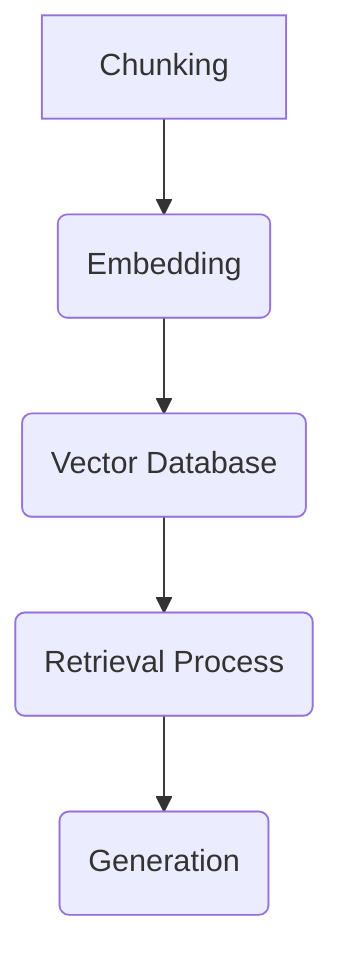

# RAG Vision

## Overview
This project is an AI-powered movie encyclopedia utilizing Retrieval-Augmented Generation (RAG) techniques. It integrates with Perplexity AI for generating movie-related responses and leverages a local CSV dataset for enhanced retrieval. The frontend is built with Next.js and React, featuring an interactive chat interface.

## Features
- **Movie Search with AI Assistance**: Queries Perplexity AI to fetch movie-related information.
- **Local Movie Database**: Searches a CSV dataset containing Wikipedia movie plots.
- **Chat Interface**: User-friendly chat interface built with Next.js, React, and Framer Motion.
- **Streaming Responses**: Optimized API handling for fast and interactive responses.
- **Vector Search**: Implements Pinecone for efficient movie data retrieval.

## Tech Stack
- **Frontend**: Next.js, React, Tailwind CSS, Framer Motion
- **Backend**: Next.js API routes
- **Database**: CSV-based local search
- **APIs**: Perplexity AI, Pinecone, Hugging Face

## Setup Instructions
### Prerequisites
- Node.js (v18 or later)
- npm or yarn

### Installation
1. Clone the repository:
   ```sh
   git clone https://github.com/kalashvasaniya/rag-vision
   cd rag-vision
   ```

2. Install dependencies:
   ```sh
   npm install
   ```

3. Create a `.env.local` file and add API keys:
   ```sh
   PERPLEXITY_API_KEY=your_perplexity_api_key
   PINECONE_API_KEY=your_pinecone_api_key
   PINECONE_INDEX_NAME=rag-vision
   PINECONE_ENVIRONMENT=us-east-1
   HUGGINGFACE_API_KEY=your_huggingface_api_key
   ```

### Running the App
To start the development server:
```sh
npm run dev
```
The application will be available at [http://localhost:3000](http://localhost:3000).

## API Endpoints
### `/api/chat`
- **Method**: POST
- **Description**: Handles chat interactions by querying Perplexity AI and local movie database.
- **Request Body**:
  ```json
  {
    "messages": [
      { "role": "user", "content": "Tell me about Inception" }
    ]
  }
  ```
- **Response**:
  ```json
  {
    "content": "Inception (2010), directed by Christopher Nolan, is a mind-bending thriller about dream manipulation."
  }
  ```

### `/api/search`
- **Method**: GET
- **Description**: Searches movies in the local dataset.
- **Query Parameters**: `query` (Movie title or keyword)
- **Example Request**:
  ```sh
  GET /api/search?query=Inception
  ```
- **Response**:
  ```json
  {
    "results": [
      { "title": "Inception", "year": 2010, "director": "Christopher Nolan" }
    ]
  }
  ```

## Contributing
1. Fork the repository.
2. Create a new branch (`feature-branch-name`).
3. Make changes and commit:
   ```sh
   git commit -m 'Add new feature'
   ```
4. Push to your branch:
   ```sh
   git push origin feature-branch-name
   ```
5. Submit a pull request.

## License
This project is licensed under the **MIT License**.

## Implementing RAG
For a complete experiment on implementing RAG, refer to this Colab notebook:

### RAG Implementation Experiment
The core components involved in the implementation include:

